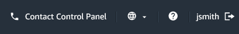
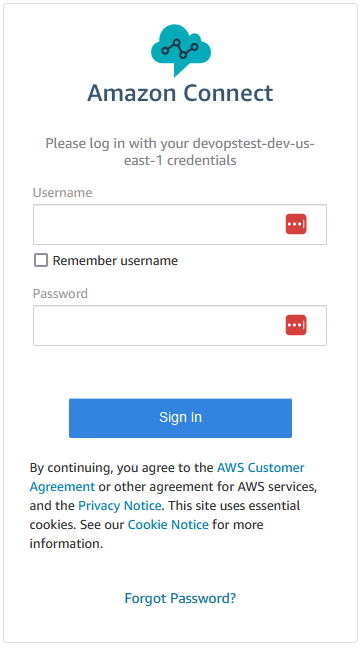

# AWS Contact Center as a Service (CCaaS) Export Utility

The CCaaS export utility included with this pattern can export Amazon Connect Contact Flows and admin objects such as Hours of Operations, Queues, Quick Connects, Routing Profiles and Security Profiles. This tool can be run against any instance and the resources will be exported out and parameterized to remove instance specific components. It is written in javascript and to use it you will need to install a current version of node and npm. When running the tool for the first time.

## Key Directories and Files

| File                                             | Description                                                                                   |
| ------------------------------------------------ | --------------------------------------------------------------------------------------------- |
| [./utils/](./utils/)                             | Contains common utilities including I/O functions and AWS SDK wrapper classes.                |
| [./utils/cx-exporter.js](./utils/cx-exporter.js) | Main script used for reading and exporing data from Amazon Connect.                           |
| [./export-cli.js](./export-cli.js)               | Entry point script, which includes a set of prompts to guide the user through export process. |

## How to execute

- Configured AWS CLI credentials with access to source AWS account
- cd into the export-cli directory
- npm install
- node export-cli.js

The tool will ask you to choose a region, hit enter for Amazon Connect resources only, and then enter an instance id from which you want to export resources.

![[export-cli.png]](./images/export-cli.png)

## Output

The resources will be exported into exports/resources.

> [!IMPORTANT]
> To use these exported resources, the files will need to be moved into import/resources using the same folder structure. The reason for this is to make the importing of resources intentional. It is very easy to run an export and then accidentally import something unintentionally.

Another way to help minimize unintentional exports is to filter using release.json in the root of the export-cli directory. Items prefixed in quotes with an exclamation point will not be exported - "!".

## Manual Configuration Requirements for Outbound Caller Id

- When configuring queues with outbound caller ID capabilities across multiple environments (dev/stg/prod),
  each queue requires environment-specific phone number mapping.

### Default Behavior

- The export tool captures phone numbers from the source (typically dev) environment
- Other environments (stg/prod) default to null values
- Manual configuration is required for multi-environment deployments

### Configuration Steps

1. Navigate to `imports/resources/queues/`
2. For each queue requiring outbound caller ID:
   - Locate the queue configuration file
   - Add environment-specific phone number mappings

```
"OutboundCallerIdNumberId": {
      "env": {
        "dev": "+15555551214",
        "stg": "+15555551213",
        "prod": "+15555551212"
      }
}
```

> [!NOTE]
>
> - Phone numbers must be in E.164 format (+{countrycode}{number})
> - All environment mappings should be completed before deployment
> - Remove mappings for unused environments to prevent errors

## Testing the Solution

In this step, we will validate the deployment and make sure that the Contact Center works as expected.

To **test** that the solution works, we need to get into Amazon Connect, [claim a phone number](https://docs.aws.amazon.com/connect/latest/adminguide/tutorial1-claim-phone-number.html)

and attach it to the 'ACME_Main' flow. The example shows a US DID, however choose whatever works for you.


**Call** the phone number that you claimed in the previous step. The contact flow will ask which department you need. Say "Sales" or "Finance" to enter the customer queue. You will hear a queue message and then music and this can end the workshop. To answer a call, continue with the next few steps.

Two users were created as part of the admin objects pipeline, sales_agent and finance_agent. The passwords for each are SomeSecurePassword!1234.

**Navigate** to Amazon Connect in the AWS portal and select the system that you just created, and click the Access URL. If for some reason, it comes up logged in with the default admin user, you will need to log it out so that you can log back in with one of the newly created users. Click the [-> icon and you should be prompted to log in.





**Navigate** to the Real-time Metrics page
![[tfcicd-metrics.png]](./images/tfcicd-metrics.png)

**Add** Queues and Agents to the Real-time Metrics page and then open up the Agent Workspace control panel from the top of the menu bar and set yourself to available so that you can answer a call.

![[tfcicd-agent.png]](./images/tfcicd-agent.png)

**Call** in, say Sales or Finance depending on which type of agent you logged in as. You will be placed into the queue and then as the agent you can **answer** the call. You should hear customer and agent whisper flows played. If you navigate to real-time metrics you will see a call.

![[tfcicd-met2.png]](./images/tfcicd-met2.png)

To deploy stage, create a new branch for stage and repeat all steps in this section.

```cli
git checkout -b stage
```

To deploy main, switch to the main branch and repeat all steps in this section.

```cli
git checkout main
```
